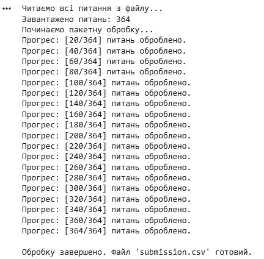

## Gemini API Batch Processing Pipeline for Agentic AI Challenge

This repository contains a resilient Python data pipeline designed for processing large text datasets using Google Gemini models with reasoning capabilities (`thinking_config`). 

The pipeline was built as an engineering solution for a technical challenge within the **"Grow your business with Google Cloud: The Era of AI Agents"** program, specifically handling a realistic, noisy IT-corpus from **DOU.ua**.

### 📌 Context & Practical Challenges
The objective of the challenge was to build an Agentic AI workflow capable of navigating thousands of documents, identifying up to 10 relevant source URLs, and generating three precise atomic claim responses (`c1`, `c2`, `c3`) for each question.

#### Engineering Constraints Resolved:
* **Google AI Studio Resource Limits:** Free tier API profiles strictly throttle requests per minute. Generating answers row-by-row causes constant timeouts.
* **Reasoning Model Overhead:** Utilizing `gemini-3-flash-preview` with `thinking_level="HIGH"` yields superior data synthesis but increases response latencies, making request optimization critical.

---

### 🚀 Architectural Solutions Implemented

* **Smart Chunking (Batch Size = 20):** Grouped multiple JSONL questions into optimized batch request structures. This allowed the reasoning model to think through complex IT documents simultaneously without dropping structure or quality.
* **Resilient Retry Mechanism (Exponential Backoff):** Embedded automated exception handling for `APIError` (handling standard rate limits like `429 Too Many Requests`). The pipeline automatically doubles its sleep interval (`delay *= 2`) between attempts to safely recover without crashing the pipeline execution.
* **Real-time Safe Output Validation:** Implemented an on-the-fly CSV text structural validator. The script dynamically checks for markdown formatting artifacts (` ``` `), deduplicates unwanted headers, verifies correct `question_id` matching, and stream-appends results directly to the disk to protect state progression.
* **Environment Agnostic Credentials:** Replaced hardcoded credentials with a flexible abstraction that queries both Google Colab `userdata` and native system environment variables (`os.getenv`).
* **Localization Engineering:** Successfully prompted and leveraged specialized instructions in the Ukrainian language to ensure contextually accurate data retrieval from regional tech articles.

---

### 📊 Pipeline Processing Visualization (Colab Logs)
Below is the execution state demonstrating batch chunks progressing stable under API stress constraints:

<p align="center">
  
</p>
